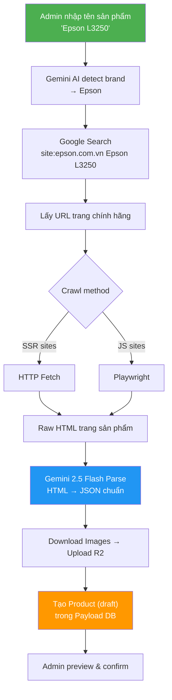
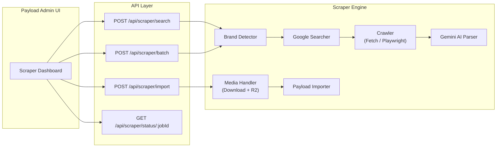
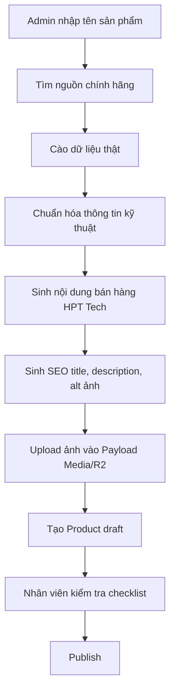

# HPTTech Product Scraper — Hệ thống cào dữ liệu sản phẩm tự động

## Mục tiêu

Xây dựng hệ thống tự động hóa nhập sản phẩm: admin chỉ cần **nhập tên sản phẩm** (VD: "Epson L3250"), hệ thống tự tìm trang sản phẩm chính hãng, cào dữ liệu thật, và import vào Payload CMS. Tích hợp trực tiếp vào project HPTTech.

**Chiến lược MVP**: Admin nhập trực tiếp URL sản phẩm chính hãng → HTTP Fetch/Playwright crawl → Gemini 2.5 Flash parse/enrich HTML → Import Payload DB (draft) + R2 images.

> Giai đoạn MVP ưu tiên nhập link sản phẩm để tránh phụ thuộc Google Custom Search/Gemini Search grounding. Sau khi luồng crawl/import ổn mới quay lại bài toán tự tìm URL từ tên sản phẩm.

---

## Flow chính



### Ví dụ thực tế

```
👤 Admin nhập: "Brother HL-L2321D"

🤖 Hệ thống:
  1. Detect brand: "Brother" → brother.com.vn
  2. Google: "site:brother.com.vn Brother HL-L2321D"
  3. Tìm được: https://www.brother.com.vn/vi-vn/products/all-printers/hl-l2321d
  4. Crawl trang đó (Playwright vì Brother dùng JS)
  5. Gemini parse HTML → JSON:
     {
       title: "Brother HL-L2321D",
       sku: "HL-L2321D",
       price: "2.990.000đ",
       specs: [
         {label: "Tốc độ in", value: "30 trang/phút"},
         {label: "In 2 mặt", value: "Tự động"},
         ...
       ],
       images: ["https://...product-image.jpg"],
       description: "Máy in laser đơn sắc..."
     }
  6. Download ảnh → upload R2
  7. Tạo Product trong Payload (draft)
  8. ✅ Admin review → publish
```

---

## Chế độ nhập

### Single Mode
- Nhập 1 tên sản phẩm → nhận kết quả ngay
- Có preview trước khi import

### Batch Mode
- Paste danh sách tên sản phẩm (mỗi dòng 1 tên)
- Hoặc chọn hãng → hệ thống tự crawl trang listing lấy tất cả sản phẩm
- Xử lý tuần tự với progress bar
- Kết quả hiển thị dạng bảng: ✅ thành công / ⚠️ cần review / ❌ lỗi

---

## Kết quả nghiên cứu các website hãng

| Hãng | Domain | Crawl method | Anti-scraping | Độ khó |
|------|--------|-------------|---------------|--------|
| Epson | epson.com.vn | HTTP fetch | Thấp | 🟢 Dễ |
| Ricoh | ricoh.com.vn | HTTP fetch | Thấp | 🟢 Dễ |
| Canon | **vn.canon** ⚠️ | HTTP fetch | Trung bình | 🟡 Vừa |
| Brother | brother.com.vn | Playwright | Trung bình | 🟡 Vừa |
| HP | hp.com/vn-vi | Playwright stealth | **Cao (Akamai)** | 🔴 Khó |
| Kyocera | kyoceradocumentsolutions.com.vn | Chưa khảo sát | — | — |
| Konica Minolta | konicaminolta.com/vn-vi | Chưa khảo sát | — | — |

> [!IMPORTANT]
> **Canon** dùng domain `vn.canon`, không phải `canon.com.vn`.
> **HP** có Akamai Bot Manager — cần Playwright stealth + random delays.

---

## Kiến trúc hệ thống



---

## Proposed Changes

### Component 1: Scraper Engine — `lib/scraper/`

#### [NEW] [types.ts](file:///e:/Claude/HPTTech/lib/scraper/types.ts)
TypeScript types cho toàn bộ scraper system:

```typescript
// Kết quả tìm kiếm trước khi import
interface ScrapedProduct {
  source: {
    brand: string;          // "Epson"
    url: string;            // URL trang chính hãng
    searchQuery: string;    // Query đã dùng
  };
  data: {
    title: string;
    sku?: string;
    price?: string;
    compareAtPrice?: string;
    summary?: string;       // Mô tả ngắn (cào từ hãng)
    description?: string;   // Nội dung chi tiết (cào từ hãng)
    specs: Array<{ label: string; value: string }>;
    imageUrls: string[];    // URLs gốc từ hãng
    warranty?: string;
    origin?: string;
  };
  confidence: number;       // 0-1: AI tự đánh giá độ tin cậy
  warnings: string[];       // VD: "Không tìm thấy giá"
}

// Job config
interface ScrapeJob {
  id: string;
  mode: "single" | "batch";
  inputs: string[];         // Danh sách tên sản phẩm
  status: "pending" | "running" | "done" | "error";
  progress: { current: number; total: number };
  results: ScrapedProduct[];
  errors: Array<{ input: string; error: string }>;
}

// Brand config
interface BrandConfig {
  name: string;
  slug: string;
  domain: string;           // "epson.com.vn"
  crawlMethod: "fetch" | "playwright";
  delayMs: number;
  aliases: string[];         // ["epson", "ep"] — để detect
}
```

#### [NEW] [brand-detector.ts](file:///e:/Claude/HPTTech/lib/scraper/brand-detector.ts)
Detect brand từ tên sản phẩm:
- **Bước 1**: Keyword matching (nhanh, chính xác) — "Epson L3250" → match "Epson"
- **Bước 2**: Nếu không match → hỏi Gemini AI xác định brand
- Return: `BrandConfig` tương ứng

```
"Epson L3250"      → Epson     ✅ keyword match
"HL-L2321D"        → Brother   ✅ Gemini detect (model prefix HL = Brother)
"imageCLASS MF445" → Canon     ✅ Gemini detect
```

#### [NEW] [searcher.ts](file:///e:/Claude/HPTTech/lib/scraper/searcher.ts)
Tìm URL sản phẩm chính hãng:
- **Phương pháp chính**: Google Custom Search API
  - Query: `site:{brand.domain} {productName}`
  - VD: `site:epson.com.vn Epson L3250`
  - Lấy top 1-3 results → Gemini AI chọn URL đúng nhất
- **Fallback**: Nếu Google không tìm được → Gemini với Search grounding
- Return: URL chính xác của trang sản phẩm

> [!NOTE]
> Google Custom Search API miễn phí 100 queries/ngày. Đủ cho use case ~700 sản phẩm (chia 7 ngày). Hoặc dùng plan $5/1000 queries.

#### [NEW] [crawler.ts](file:///e:/Claude/HPTTech/lib/scraper/crawler.ts)
Crawl trang sản phẩm:
- `fetchPage(url)` — HTTP fetch cho SSR sites (Epson, Ricoh, Canon)
- `playwrightPage(url, options)` — Playwright cho JS sites (Brother, HP)
- Playwright stealth config riêng cho HP (Akamai bypass)
- Rate limiting với configurable delay
- Clean HTML: loại bỏ scripts, styles, nav, footer → giữ main content (giảm token cho Gemini)

> MVP hiện dùng Playwright local cho brand có `crawlMethod: "playwright"`. Playwright không chạy trên Vercel; scraper nên chạy ở máy local/admin workstation, sau đó dữ liệu draft nằm trong Payload DB.

#### [NEW] [parser.ts](file:///e:/Claude/HPTTech/lib/scraper/parser.ts)
Parse HTML thành structured data:
- **Ưu tiên 1**: Tìm JSON-LD `<script type="application/ld+json">` → extract Product schema
- **Ưu tiên 2**: Gửi cleaned HTML cho Gemini → parse ra `ScrapedProduct`
- Gemini prompt template:

```
Bạn là chuyên gia extract dữ liệu sản phẩm từ HTML.
Hãy trích xuất thông tin sau từ HTML trang sản phẩm {brand}:
- title: Tên đầy đủ sản phẩm
- sku: Mã model/SKU
- price: Giá bán (giữ nguyên format VNĐ)
- specs: Bảng thông số kỹ thuật [{label, value}]
- description: Mô tả sản phẩm (giữ nguyên text gốc, KHÔNG sáng tác)
- imageUrls: Tất cả URL hình ảnh sản phẩm
- warranty: Thông tin bảo hành
...
Trả về JSON. Nếu không tìm thấy field nào, để null.
Đánh giá confidence (0-1) dựa trên chất lượng dữ liệu tìm được.
```

- Validation: check required fields, format consistency
- Return: `ScrapedProduct`

#### [NEW] [media.ts](file:///e:/Claude/HPTTech/lib/scraper/media.ts)
Xử lý hình ảnh:
- Download images từ URLs gốc (concurrent, với retry)
- Upload vào Payload Media collection → tự động lên R2
- Return: Payload Media document IDs
- Skip duplicate images (check by filename/hash)

#### [NEW] [importer.ts](file:///e:/Claude/HPTTech/lib/scraper/importer.ts)
Import vào Payload:
- Map `ScrapedProduct` → Payload Product schema
- Auto-lookup Brand relationship (tìm brand đã có trong DB)
- Auto-lookup/suggest Category (Gemini gợi ý category phù hợp từ danh mục có sẵn)
- Create Product với `status: "draft"`
- Duplicate check: tìm theo SKU hoặc title trước khi tạo
- Return: Payload Product ID

#### [NEW] [engine.ts](file:///e:/Claude/HPTTech/lib/scraper/engine.ts)
Orchestrator chính:
- `searchProduct(name)` — Single mode: tên → ScrapedProduct (preview)
- `importProduct(scrapedProduct)` — Confirm import vào Payload
- `batchScrape(names[])` — Batch mode: danh sách tên → chạy tuần tự
- Job management: tạo/track/cancel jobs
- Event emitter cho realtime progress updates

---

### Component 2: Brand Configurations — `lib/scraper/brands/`

#### [NEW] [index.ts](file:///e:/Claude/HPTTech/lib/scraper/brands/index.ts)
Registry tất cả brand configs + `detectBrand(productName)` helper

#### [NEW] [epson.ts](file:///e:/Claude/HPTTech/lib/scraper/brands/epson.ts)
```typescript
export const epsonConfig: BrandConfig = {
  name: "Epson",
  slug: "epson",
  domain: "epson.com.vn",
  crawlMethod: "fetch",
  delayMs: 2000,
  aliases: ["epson", "ep"],
};
```

#### [NEW] [ricoh.ts](file:///e:/Claude/HPTTech/lib/scraper/brands/ricoh.ts)
#### [NEW] [canon.ts](file:///e:/Claude/HPTTech/lib/scraper/brands/canon.ts)
- Domain: `vn.canon` (không phải canon.com.vn)

#### [NEW] [brother.ts](file:///e:/Claude/HPTTech/lib/scraper/brands/brother.ts)
- `crawlMethod: "playwright"` (cần JS cho specs)

#### [NEW] [hp.ts](file:///e:/Claude/HPTTech/lib/scraper/brands/hp.ts)
- `crawlMethod: "playwright"` + stealth options
- `delayMs: 4000` (cao hơn vì Akamai)

---

### Component 3: API Endpoints

#### [NEW] [app/(payload)/api/scraper/search/route.ts](file:///e:/Claude/HPTTech/app/(payload)/api/scraper/search/route.ts)
```
POST /api/scraper/search
Body: { query: "Epson L3250" }
Response: {
  product: ScrapedProduct,  // Preview data
  found: true
}
```
- Single mode: tìm + cào 1 sản phẩm, trả preview
- Admin xem preview rồi quyết định import hay không

#### [NEW] [app/(payload)/api/scraper/import/route.ts](file:///e:/Claude/HPTTech/app/(payload)/api/scraper/import/route.ts)
```
POST /api/scraper/import
Body: { scrapedProduct: ScrapedProduct, categoryId?: string }
Response: { productId: string, status: "draft" }
```
- Confirm import: download ảnh + tạo Product trong Payload

#### [NEW] [app/(payload)/api/scraper/batch/route.ts](file:///e:/Claude/HPTTech/app/(payload)/api/scraper/batch/route.ts)
```
POST /api/scraper/batch
Body: { queries: ["Epson L3250", "Brother HL-L2321D", ...] }
Response: { jobId: string }
```
- Batch mode: chạy background, track qua status endpoint

#### [NEW] [app/(payload)/api/scraper/status/[jobId]/route.ts](file:///e:/Claude/HPTTech/app/(payload)/api/scraper/status/[jobId]/route.ts)
```
GET /api/scraper/status/:jobId
Response: { status, progress, results[], errors[] }
```

---

### Component 4: Payload Admin UI

#### [NEW] [components/payload/ScraperDashboard.tsx](file:///e:/Claude/HPTTech/components/payload/ScraperDashboard.tsx)
Custom view trong Payload Admin — giao diện chính:

```
┌─────────────────────────────────────────────────┐
│  🔍 Cào dữ liệu sản phẩm                       │
│                                                  │
│  ┌──────────────────────────────────────┐        │
│  │ Nhập tên sản phẩm...                │ [Tìm]  │
│  └──────────────────────────────────────┘        │
│                                                  │
│  ── hoặc ──                                      │
│                                                  │
│  ┌──────────────────────────────────────┐        │
│  │ Epson L3250                          │        │
│  │ Brother HL-L2321D                    │ [Cào   │
│  │ Canon imageCLASS MF445dw            │  hàng  │
│  │ Ricoh IM C300F                       │  loạt] │
│  └──────────────────────────────────────┘        │
│                                                  │
├─────────────────────────────────────────────────┤
│  📋 Preview kết quả                              │
│                                                  │
│  ┌─────────┐                                     │
│  │  [IMG]  │  Epson L3250                        │
│  │         │  SKU: L3250                          │
│  │         │  Giá: 3.890.000đ                    │
│  │         │  Brand: Epson | Category: [Chọn ▾]  │
│  │         │  Specs: 12 thông số                  │
│  └─────────┘  Confidence: 95% ✅                 │
│                                                  │
│  Mô tả: "Máy in phun đa năng Epson..."         │
│                                                  │
│           [❌ Bỏ qua]  [✅ Import vào CMS]       │
├─────────────────────────────────────────────────┤
│  📊 Batch Progress (nếu đang chạy)              │
│  ████████░░░░░░░  8/20 sản phẩm                 │
│                                                  │
│  ✅ Epson L3250        → Imported (draft)        │
│  ✅ Brother HL-L2321D  → Imported (draft)        │
│  ⚠️ Canon MF445dw     → Thiếu giá, cần review  │
│  🔄 Ricoh IM C300F    → Đang cào...             │
│  ⏳ HP LaserJet M111w → Chờ...                  │
└─────────────────────────────────────────────────┘
```

#### [MODIFY] [payload.config.ts](file:///e:/Claude/HPTTech/payload.config.ts)
- Thêm custom admin view: Scraper Dashboard
- Thêm nav link "🔍 Cào dữ liệu" trong sidebar

---

### Component 5: Scraper Jobs Collection

#### [NEW] [collections/ScraperJobs.ts](file:///e:/Claude/HPTTech/collections/ScraperJobs.ts)
Lưu lịch sử cào:
- Fields: `query`, `brandDetected`, `sourceUrl`, `status`, `productCreated` (relationship), `confidence`, `errors`, `createdAt`
- Admin có thể xem lại lịch sử: đã cào gì, từ đâu, kết quả

---

### Component 6: Dependencies

#### [MODIFY] [package.json](file:///e:/Claude/HPTTech/package.json)
Thêm dependencies:
| Package | Mục đích |
|---------|----------|
| `playwright` | Browser automation (Brother, HP) |
| `cheerio` | HTML parsing (Epson, Ricoh, Canon) |
| `@google/generative-ai` | Gemini API SDK |
| `p-queue` | Promise queue + rate limiting |

#### [MODIFY] [.env.example](file:///e:/Claude/HPTTech/.env.example)
```env
# Scraper
GEMINI_API_KEY=             # Google AI Studio API key
GOOGLE_SEARCH_API_KEY=      # Google Custom Search API key (optional)
GOOGLE_SEARCH_ENGINE_ID=    # Custom Search Engine ID (optional)
```

---

## Open Questions

> [!IMPORTANT]
> **Gemini API Key**: Bạn đã có chưa? Tạo miễn phí tại [Google AI Studio](https://aistudio.google.com/apikey). Model mặc định: `gemini-2.5-flash`.

> [!IMPORTANT]
> **Scraper chỉ chạy local**: Playwright không chạy trên Vercel. Scraper chạy khi `npm run dev` ở máy local. Sau khi cào xong, data nằm trong DB → website Vercel hiển thị bình thường. OK?

> [!WARNING]
> **Google Custom Search API**: Miễn phí 100 queries/ngày. Cào 700 SP = 7 ngày nếu free tier, hoặc $5/1000 queries nếu muốn nhanh. Ngoài ra có thể dùng Gemini Search grounding thay thế (miễn phí nhưng chậm hơn). Bạn thích cách nào?

> [!NOTE]
> **Kyocera & Konica Minolta**: Sẽ khảo sát và thêm config sau khi xong 5 hãng chính.

---

## Phân chia giai đoạn

### Phase 1 — Core Engine + Epson pilot
- Scraper engine: brand-detector, searcher, crawler, parser, media, importer
- Brand config: Epson (site dễ nhất)
- API endpoints: search + import
- Test: nhập "Epson L3250" → preview → import thành công

### Phase 2 — Thêm hãng dễ + Batch mode
- Brand configs: Ricoh, Canon
- Batch API endpoint
- Tinh chỉnh Gemini prompt từ kết quả Phase 1

### Phase 3 — Hãng khó + Admin Dashboard
- Brand configs: Brother (Playwright), HP (Playwright stealth)
- Build Scraper Dashboard UI trong Payload Admin
- ScraperJobs collection

### Phase 4 — Polish & mở rộng
- Kyocera, Konica Minolta
- Thêm hãng mới = chỉ thêm 1 file config
- Duplicate detection nâng cao

---

## Ước tính

| Hạng mục | Con số |
|----------|--------|
| **Gemini API cost** | ~700 SP × ~3000 tokens = ~$0.15 (Gemini Flash rất rẻ) |
| **Google Search API** | 700 queries × free tier = 7 ngày, hoặc ~$3.50 |
| **Thời gian crawl** | ~700 SP × 4s delay ≈ 47 phút |
| **Dev time** | Phase 1: 2-3 ngày, Full: 5-7 ngày |

---

## Cấu trúc thư mục

```
lib/scraper/
├── types.ts              # TypeScript types
├── brand-detector.ts     # Detect brand từ tên SP
├── searcher.ts           # Google Search tìm URL
├── crawler.ts            # HTTP fetch + Playwright
├── parser.ts             # Gemini AI parse HTML → JSON
├── media.ts              # Download ảnh + upload R2
├── importer.ts           # Tạo Product trong Payload
├── engine.ts             # Orchestrator chính
└── brands/
    ├── index.ts
    ├── epson.ts
    ├── ricoh.ts
    ├── canon.ts
    ├── brother.ts
    └── hp.ts

app/(payload)/api/scraper/
├── search/route.ts       # POST - tìm + preview 1 SP
├── import/route.ts       # POST - confirm import
├── batch/route.ts        # POST - cào hàng loạt
└── status/[jobId]/route.ts  # GET - check progress

collections/
└── ScraperJobs.ts        # Lịch sử cào

components/payload/
└── ScraperDashboard.tsx  # Admin UI
```

---

## Điều chỉnh mục tiêu: Product Auto-Fill + SEO Enrichment

Mục tiêu thực tế không chỉ là "cào dữ liệu", mà là tạo một hệ thống tự điền gần như toàn bộ hồ sơ sản phẩm trong Payload CMS. Nhân viên chỉ cần kiểm tra checklist, chỉnh các điểm nhạy cảm như giá/danh mục/ảnh chính, rồi publish.

### Flow nâng cấp



### Nguyên tắc dữ liệu

- Dữ liệu thật phải đến từ nguồn chính hãng hoặc nguồn có thể truy vết: `title`, `sku`, `specs`, `warranty`, `origin`, `imageUrls`, `datasheets`, `sourceUrl`.
- AI được phép viết lại nội dung bán hàng và SEO dựa trên dữ liệu đã lấy được, nhưng không được tự bịa thông số kỹ thuật.
- Field nào không chắc chắn thì để trống và thêm warning để nhân viên kiểm tra.
- Mọi product được import ở trạng thái `draft`, không tự publish.

### Module bổ sung

```text
lib/scraper/
├── extractor.ts       # Lấy dữ liệu gốc từ website hãng
├── enricher.ts        # Viết summary/description theo giọng HPT Tech
├── seo-generator.ts   # Sinh SEO title, description, canonical, image alt
├── validator.ts       # Kiểm tra thiếu/đủ, confidence, warning
└── review-state.ts    # Trạng thái review cho batch/job
```

Các module này nằm sau bước `parser.ts` và trước `importer.ts`.

### Mapping vào Payload Product

| Nguồn dữ liệu | Payload field | Ghi chú |
|---|---|---|
| Tên sản phẩm chuẩn | `title` | Bắt buộc |
| Model/SKU | `sku` | Dùng duplicate check |
| Brand detect | `brand` | Lookup trong `brands` |
| Category gợi ý | `category` | AI gợi ý, nhân viên xác nhận |
| Giá cào được | `price`, `compareAtPrice` | Luôn cần review |
| Mô tả ngắn AI viết | `summary` | Dựa trên dữ liệu thật |
| Bài mô tả AI viết | `description` | Có heading, lợi ích, ứng dụng |
| Thông số kỹ thuật | `specs` | Không được bịa |
| Ảnh sản phẩm | `images` | Upload qua Payload Media/R2 |
| Bảo hành/xuất xứ | `warranty`, `origin` | Nếu có nguồn |
| SEO tự sinh | `seo.title`, `seo.description`, `seo.image`, `seo.canonical` | Tối ưu cho trang public |
| Trạng thái | `status` | Luôn tạo `draft` |

### SEO auto-fill

`seo-generator.ts` sinh các field sau:

- `seo.title`: có model, loại sản phẩm, "chính hãng" hoặc "giá tốt", và thương hiệu HPT Tech.
- `seo.description`: 140-160 ký tự, có model, lợi ích chính, nhóm sản phẩm, lời mời báo giá/tư vấn.
- `seo.image`: dùng ảnh chính của sản phẩm.
- `seo.canonical`: `/san-pham/{slug}`.
- Alt ảnh: dùng format như `Máy in phun màu Epson L3250 chính hãng`.

Ví dụ:

```text
Product: Epson L3250
SEO title: Máy in phun màu Epson L3250 chính hãng, giá tốt | HPT Tech
SEO description: Epson L3250 là máy in phun màu đa năng phù hợp văn phòng và gia đình. Xem thông số, tư vấn cấu hình và nhận báo giá tại HPT Tech.
Canonical: /san-pham/epson-l3250
```

### Nội dung AI viết cho trang sản phẩm

`enricher.ts` tạo nội dung theo cấu trúc ổn định:

1. Tổng quan sản phẩm
2. Điểm nổi bật
3. Phù hợp cho nhu cầu nào
4. Thông số đáng chú ý
5. Lý do mua tại HPT Tech

Nội dung phải dựa trên specs và mô tả nguồn. Nếu thiếu dữ liệu, đoạn nội dung phải ngắn lại thay vì suy diễn.

### Checklist review cho nhân viên

Dashboard cần hiển thị checklist thay vì bắt nhân viên tự dò toàn bộ:

```text
[ ] Nguồn chính hãng đúng
[ ] Tên/SKU đúng
[ ] Brand đúng
[ ] Category đúng
[ ] Giá đã kiểm tra
[ ] Thông số kỹ thuật đủ
[ ] Ảnh chính phù hợp
[ ] SEO title/description ổn
[ ] Có thể publish
```

### Trạng thái review

```typescript
type ReviewStatus =
  | "ready_to_review"
  | "needs_human_input"
  | "approved"
  | "published"
  | "failed";
```

`ScraperJobs` nên lưu thêm:

- `sourceUrl`
- `rawExtractedData`
- `generatedContent`
- `seoPreview`
- `confidence`
- `warnings`
- `reviewStatus`
- `productCreated`

### Thứ tự triển khai đề xuất

1. Phase 1: Epson pilot với auto-fill cơ bản: title, sku, specs, summary, description, SEO, draft product.
2. Phase 2: Media/R2 upload + checklist review + ScraperJobs.
3. Phase 3: Batch mode cho Epson/Ricoh/Canon.
4. Phase 4: Playwright cho Brother/HP.
5. Phase 5: Tối ưu SEO sâu hơn: FAQ, schema enrichment, internal linking, related products suggestion.
