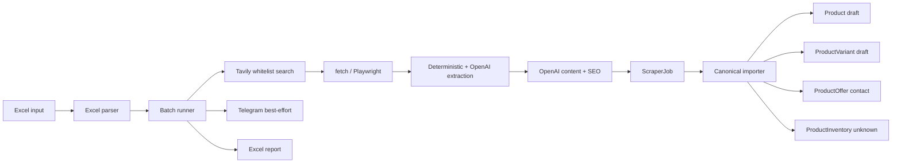

# HPT Tech Bulk Product Scraper - CLI Tool

## Trạng thái

Đã triển khai pipeline CLI nhập sản phẩm hàng loạt từ Excel.

```bash
npm run products:bulk-import -- ./data/products.xlsx
```

Các chế độ hỗ trợ:

```bash
npm run products:bulk-import -- ./data/products.xlsx --dry-run
npm run products:bulk-import -- ./data/products.xlsx --search-only
npm run products:bulk-import -- ./data/products.xlsx --skip=5
npm run products:bulk-import -- ./data/products.xlsx --limit=10
```

## Mục tiêu

CLI chạy local thực hiện:

1. Đọc danh sách sản phẩm từ Excel.
2. Tìm tối đa hai nguồn bằng Tavily:
   - Một nguồn chính hãng để lấy model và thông số.
   - Một nguồn TMĐT Việt Nam để lấy giá tham khảo.
3. Crawl HTML bằng `fetch` hoặc Playwright.
4. Trích xuất deterministic trước, sau đó dùng OpenAI để merge dữ liệu.
5. Sinh mô tả và SEO bằng OpenAI.
6. Lưu `ScraperJob` làm audit trail.
7. Import vào Catalog chuẩn gồm Product, ProductVariant, ProductOffer và ProductInventory.
8. Gửi Telegram best-effort nếu đã cấu hình.
9. Xuất báo cáo Excel.

## Quyết định đã chốt

| Nội dung | Quyết định |
|---|---|
| Input | Excel gồm `Tên sản phẩm`, `Danh mục`, `Loại sản phẩm` |
| Search | Tavily, giới hạn trong source whitelist |
| Xử lý | Tuần tự, lỗi một sản phẩm không dừng cả batch |
| AI | OpenAI, mặc định `gpt-4o-mini` |
| Hình ảnh | Crawl URL ảnh sản phẩm từ HTML/JSON-LD/gallery, download và upload vào Payload Media; bỏ qua ảnh mặc định/logo/footer |
| Trạng thái | Mọi sản phẩm do batch tạo hoặc cập nhật đều là `draft` |
| Publish | Máy scan cần đạt ngưỡng `scannerSpecs` tối thiểu 21/24 cột; ảnh được import tự động nếu nguồn có ảnh hợp lệ |
| Duplicate | Upsert theo SKU/model hiện có; không tạo slug `-v2`, `-v3` |
| Giá | Lưu tại ProductOffer, không lưu vào Product canonical |
| Kho | Tạo ProductInventory với `unknown`, số lượng `0` |
| Telegram | Best-effort; lỗi Telegram không làm thất bại batch |
| Audit | Mỗi lần chạy thật tạo một ScraperJob |
| Báo cáo | Xuất `<input>_report_YYYY-MM-DD.xlsx` |

## Kiến trúc



## Source whitelist

### Nhà bán lẻ Việt Nam

- `anphatpc.com.vn`
- `phucanh.vn`
- `hacom.vn`
- `gearvn.com`
- `thegioiscan.vn`
- `vietbis.vn`
- `tanhungha.com.vn`
- `mayvanphonghabac.com.vn`
- `sieuviet.com.vn`
- `mucinthanhdat.com`

### Hãng

Domain hãng được lấy từ `lib/scraper/brands/index.ts`:

- Epson: `epson.com.vn`, `epson.com`, `epson.eu`, `support.epson.net`
- Ricoh / Fujitsu: `ricoh.com.vn`, `ricoh.com`, `ricoh-usa.com`, `pfu.ricoh.com`
- Canon: `vn.canon`, `canon.com`, `usa.canon.com`, `support.usa.canon.com`
- Brother: `brother.com.vn`, `brother.com`, `brother-usa.com`, `brother.co.uk`, `support.brother.com`
- HP: `hp.com/vn-vi`, `hp.com`, `support.hp.com`
- Avision: `avision.com`
- Plustek: `plustek.com`
- Kodak Alaris: `alarisworld.com`, `kodakalaris.com`
- Panasonic: `panasonic.com/vn`, `panasonic.com`

PDF vẫn bị bỏ qua ở giai đoạn này. Các URL download, driver và firmware cũng bị loại khỏi
danh sách crawl HTML vì không cung cấp bảng thông số sản phẩm trực tiếp.

## Luồng một sản phẩm

1. Nhận `ExcelRow`.
2. Tavily tìm các URL trong whitelist.
3. Chọn tối đa một URL hãng và một URL nhà bán lẻ.
   URL chỉ được chọn khi title hoặc URL chứa đúng model từ Excel.
   Kết quả gần giống model bị loại bỏ để tránh nhập nhầm sản phẩm.
   URL PDF, download, driver và firmware bị loại bỏ.
4. Crawl độc lập từng URL; một nguồn lỗi vẫn dùng nguồn còn lại.
5. Extractor đọc JSON-LD, meta và bảng thông số.
6. OpenAI merge:
   - Specs/model ưu tiên hãng.
   - Giá ưu tiên nhà bán lẻ.
   - Không yêu cầu AI trả dữ liệu ảnh; ảnh được lấy deterministic từ HTML/JSON-LD/gallery.
   - Model/SKU canonical luôn lấy từ tên sản phẩm trong Excel, không dùng SKU
     nội bộ của nhà bán lẻ.
7. Validator tính confidence, không trừ điểm nếu nguồn không có ảnh.
8. Chế độ chạy:
   - `--search-only`: dừng sau bước chọn nguồn.
   - `--dry-run`: chạy crawl/AI nhưng không ghi DB hoặc Telegram.
   - Bình thường: lưu ScraperJob và import canonical draft.
9. Ghi kết quả vào report, gửi Telegram nếu có cấu hình.

## Catalog mapping

| Dữ liệu scrape | Collection / field |
|---|---|
| Tên, model, brand, category | Product |
| SKU, warranty | ProductVariant |
| Technical specs máy scan | Product `scannerSpecs`; không ghi `Product.specs` tự do |
| Giá VND | ProductOffer |
| Trạng thái kho chưa xác minh | ProductInventory |
| Nguồn, raw data, content, confidence, warning | ScraperJob |
| Mô tả, summary, SEO | Product |
| Ảnh | Tải ảnh sản phẩm hợp lệ và gắn vào `images` qua Payload Media |

Canonical Product luôn được import ở `draft`. Validation publish hiện có trong
`collections/Products.ts` tiếp tục là cổng kiểm soát cuối cùng.

## Module

### CLI và batch

- `scripts/bulk-import.ts`
- `lib/scraper/batch-options.ts`
- `lib/scraper/batch-runner.ts`
- `lib/scraper/excel-parser.ts`
- `lib/scraper/report.ts`
- `lib/scraper/telegram.ts`

### Search và extraction

- `lib/scraper/tavily-searcher.ts`
- `lib/scraper/crawler.ts`
- `lib/scraper/extractor.ts`
- `lib/scraper/enricher.ts`
- `lib/scraper/validator.ts`
- `lib/scraper/engine.ts`

### Catalog import

- `lib/scraper/canonical-row.ts`
- `lib/scraper/spec-normalizer.ts`
- `lib/scraper/db-lookup.ts`
- `lib/scraper/batch-importer.ts`
- `lib/canonical-product-import-export.ts`

## Environment

```env
DATABASE_URI=
PAYLOAD_SECRET=

TAVILY_API_KEY=
TAVILY_SEARCH_DEPTH=advanced
TAVILY_SEARCH_TIMEOUT_MS=20000

OPENAI_API_KEY=
OPENAI_MODEL=gpt-4o-mini
OPENAI_SCRAPER_TIMEOUT_MS=45000

TELEGRAM_BOT_TOKEN=
TELEGRAM_CHAT_ID=
TELEGRAM_TIMEOUT_MS=10000

SCRAPER_DELAY_MS=3000
SCRAPER_DB_TIMEOUT_MS=5000
SCRAPER_MAX_HTML_CHARS=60000
SCRAPER_FETCH_TIMEOUT_MS=30000
PLAYWRIGHT_HEADLESS=true
PLAYWRIGHT_TIMEOUT_MS=30000
PLAYWRIGHT_IDLE_TIMEOUT_MS=8000
```

Không lưu token thật trong tài liệu hoặc Git.

## Input mẫu

| Tên sản phẩm | Danh mục | Loại sản phẩm |
|---|---|---|
| Brother ADS-4700W | Máy scan | scanner |
| Epson L3250 | Máy in | printer |
| Canon imageCLASS MF445dw | Máy in | printer |

`Loại sản phẩm` nên dùng ProductType code (`scanner`, `printer`,
`photocopier`). CLI cũng nhận tên ProductType đang có trong Payload.

## Verification

### Automated

```bash
npm run test:bulk-import
npm run test:scraper-multi-source
npm run test:scraper-canonical-row
npm run typecheck
npm run lint
```

### Smoke test

```bash
npm run products:bulk-import -- ./data/test-products.xlsx --search-only --limit=1
npm run products:bulk-import -- ./data/test-products.xlsx --dry-run --limit=1
npm run products:bulk-import -- ./data/test-products.xlsx --limit=1
```

Sau lượt chạy thật, kiểm tra:

1. Product là `canonical` và `draft`.
2. Product có `images` nếu nguồn có ảnh hợp lệ; không lấy logo/default/footer.
3. Variant là `draft`.
4. Offer là `contact`.
5. Inventory là `unknown`.
6. ScraperJob liên kết đúng Product.
7. Chạy lại cùng SKU không tạo Product hoặc Variant mới.
